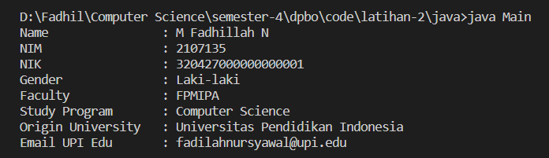

# LATIHAN2DPBO2023
Buatlah program berbasis OOP menggunakan bahasa pemrograman C++, Java, Python, dan PHP yang mengimplementasikan konsep Multi-level Inheritance  pada kelas - kelas tersebut:
- Mahasiswa: NIM, nama, jenis_kelamin, fakultas, prodi
- Human: NIK, nama, jenis_kelamin
- SivitasAkademik: asal_universitas, email_edu
---
- -
Saya Muhammad Fadhillah Nursyawal NIM 2107135 mengerjakan soal Latihan 2 
dalam mata kuliah Desain Pemrograman Berorientasi Objek 
untuk keberkahanNya maka saya tidak melakukan kecurangan seperti yang telah dispesifikasikan. Aamiin.

## Program
mengimplementasikan konsep Multi-level Inheritance  pada kelas - kelas
1. **Human** > sebagai parent dari kelas `student`
2. **Student** > sebagai child dari kelas `Human` dan parent dari kelas `SivitasAcademic`
1. **SivitasAcademic** > sebagai child dari kelas `student` 

kenapa `human` menjadi kelas paling atas karena kelas human menjadi dasar dari kelas `student` dan student mempunyai method yang sama dengan human, karena student merupakan human.

lalu kelas dari `sivitas akademik` merupakan child dari kelas student karena sivitas akademik memiliki student
## Dokumentasi
